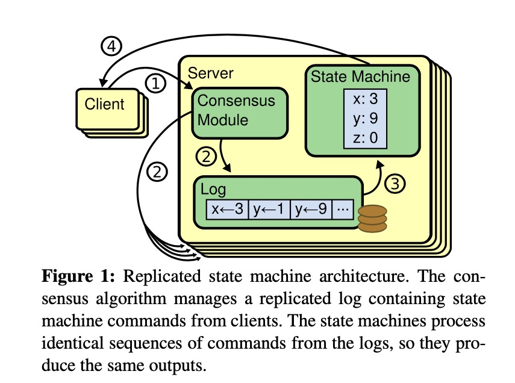
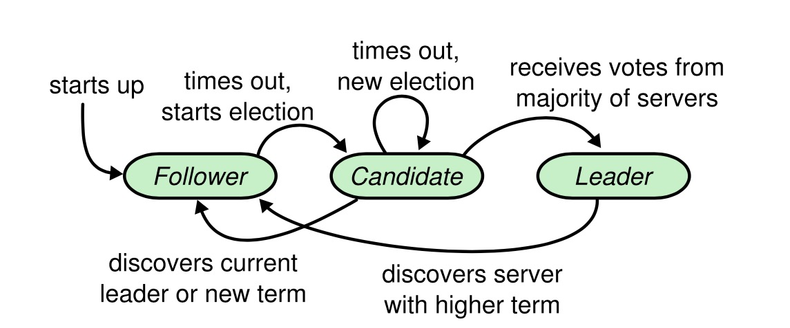
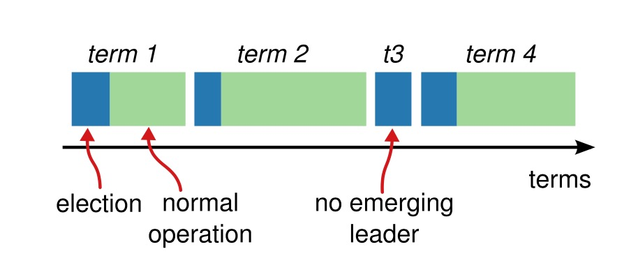
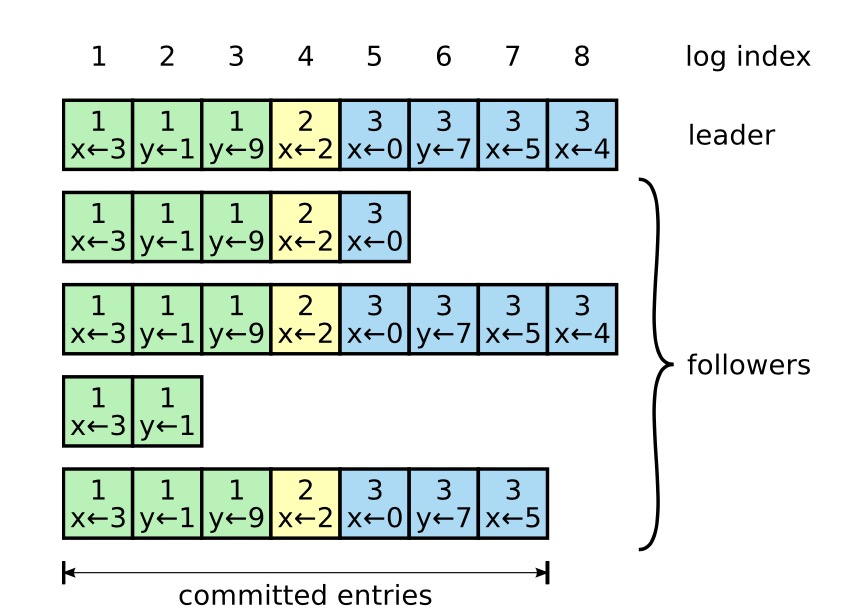

title: 6.824 Lecture 5 Fault Tolerance Raft (1) Notes & Paper Reading
date: 2021-11-01
category: course
tags: mit6.824, distributed-system, raft, paper-reading
slug: mit6.824-letcture5-notes-raft1
author: tonychow
summary: 

## 1 概要

本课主题是分布式系统中容错相关内容，主要是对一致性算法 Raft 进行分析讨论。Raft 是一个用于分布式系统中多副本之间维持数据一致性的算法，它能实现接近 Paxos 算法的性能和功能，但是更容易理解和实现。Raft 的一个创新点是在于将一致性的实现分离为更容易理解的选举及日志复制等几部分。

Raft 算法目前在业界已经有不少的实现及应用，比如 etcd 就是基于 Raft 算法构建了一个容错的分布式 kv 存储系统，并且广泛被应用在线上生产环境中，经受了真实应用场景的考验。对于 Raft 算法的讨论分为两节课，本节主要涉及到 Raft 基础的结构及概念，以及选举、日志复制相关内容。

本课相关的材料:

- 课堂 Paper: https://pdos.csail.mit.edu/6.824/papers/raft-extended.pdf
- 课堂录像: https://youtu.be/R2-9bsKmEbo
- 课堂 Note: https://pdos.csail.mit.edu/6.824/notes/l-raft.txt

## 2 要点

### 2.1 一种模式

- MapReduce 依赖单个 Master 来组织计算
- GFS 支持数据副本复制，但是依赖单个 Master 来选择数据副本的 Primary 节点
- VMWare FT 支持复制，但是需要依赖 test-and-set 来选择 Primary 节点

之前课程涉及到的分布式系统中，架构上都是依赖单个服务来做关键的决策，这有一点好处是可以避免多服务可以参与决策下因为网络分区等异常导致的脑裂现象。但是，在一个大型的分布式系统中，单点决策总是会影响到整个系统的健壮性和可用性。

### 2.2 脑裂

- 在一个存在多个复制节点的分布式系统中，当发生网络分区时，各个节点可能各自执行不同的用户操作，从而导致多个节点之间的状态无法维持一致，这样就出现了脑裂；
- 客户端对于服务宕机和网络故障导致的服务不响应这两种异常状态是无法识别的
- 这两种异常对于客户端来说，表现都是一致的：服务无网络响应

### 2.3 一种解决方案: 多数票决

- 奇数数量的服务节点：比如 3
- 对于任意关键操作 (用户修改命令、配置变更)都需要多数服务达到一致决策
- 发生网络分区时，最多只能有一个分区有多数服务节点，所以另外一个分区不会进行决策导致数据不一致，并且奇数量服务打破了偶数数量服务的对称可能性；
- 多数服务是指整体服务节点中的多数，而不是当前存活的服务节点中多数
- 如果需要容忍 f 个服务宕机：服务节点总数为 2f+1；
- 这种方案通常也被称为 quorum

早期的一致性算法(1990年左右)

- Paxos
- View-Stamped

近期算法(2014)：

- Raft

### 2.4 Raft 总览

在论文中， Raft 主要是从状态机副本复制的角度来描述的，架构上 Raft 层在状态机的每个副本中以库的形式被包含使用，多个状态机副本之间通过 Raft 算法来实现操作命令的同步和一致性维护。

架构：客户端 -> 3 副本 -> 副本  k/v 层+状态机 -> raft 层 + 日志

客户端命令流程

1. 客户端发生 put/get 命令到 leader 服务节点的 k/v 层;
2. leader 添加命令到日志队列；
3. leader 发送 AppendEntries 远程调用到 followers 服务节点以同步命令日志；
4. follower 添加命令到日志队列；
5. leader 等待多数服务响应，包含其自身；
6. 如果多数服务都成功把命令添加到其日志队列中，则该命令被视为已经提交 (committed)
7. leader 执行命令，并响应给客户端；
8. leader 在下一次发送给 followers 服务节点的 AppendEntry 请求中加上命令提交的信息；
9. follower 也在 k/v 层执行命令，更新状态；

为什么使用日志?

- 日志是追加操作，可以维持命令执行的顺序，每个服务节点的 k/v 层按顺序执行命令之后，可以保证多个状态机副本之间的状态一致；
- 多个副本可以保持一致的命令顺序；
- Leader 可以保证所有的 follower 都有同样的日志
- 日志队列可以用于提交执行前暂存
- 日志队列存储了命令可以方便 leader 重新发生旧的命令同步给 follower
- 日志队列持久化存储命令可以实现重启后回放执行命令，恢复状态机状态

Raft 设计的两个重点

1. 选主: 选择一个服务节点作为 leader
2. 保证各个服务节点之间的日志在异常失败的情况下还是一致的

### 2.5 Raft 选主

为什么需要一个 leader ?

- 需要所有的副本都按照一致的顺序执行同样的命令
- leader 接收客户端请求并确定执行的顺序，无 leader 多副本之间并发情况下保证一致执行顺序很困难

Raft 中多个服务节点都有可能担任 leader 角色

- 一个服务节点担任 leader 的时间内为一个 term
- 一个 term 内只能有一个  leader
- 一个 term 内可以没有 leader

开始选主的时机

- follower 节点在选定的选举超时时间内没有接收到来自 leader 的定时心跳
- 该节点当前的 term 值加一，然后开始尝试收集投票

如何保证一个 term 内只有一个 leader?

- 一个节点需要接收到来自集群中多数节点的投票同意
- 每个节点只能投一票：处于候选者 (candidate) 角色的会投给自己，非候选者角色则投票给第一个请求的

服务节点识别新 leader

- 新 leader 节点接收到多数的投票
- 其他服务节点接收到一个有更高 term 值的 AppendEntry 心跳请求

一次选举可能会没有 leader 产生

- 少于多数(过半)的服务节点无法访问
- 多个同时请求投票的候选者分离了选票，没有一个成功拿到多数节点的投票

一次选举失败后

- 在一次超时后还是没有接收到任何 leader 的心跳消息，term 值递增并开始新的选举
- 更高的 term 值优先级别高于旧 term 的候选者，旧的候选者退出选举

如何避免选票分离 (split vote)？

- 每个服务节点选择一个范围内随机的选举超时时间(election timeout)
- 在 leader 挂掉的时候，其他 follower 节点同时发起选举请求的可能性大大降低，避免了选票的分离

选举超时值选取？

- 至少几个心跳间隔，避免网络丢弃了一个心跳导致重新选主
- 随机的范围应该能支持一个 candidate 在另外一个开始前成功
- 尽量快速响应异常，避免长时间的停顿

## 3 Paper

本课阅读讨论的论文是 [In search of an Understandable Consensus Algorithm (Extended Version) ](https://ramcloud.atlassian.net/wiki/download/attachments/6586375/raft.pdf) (2014)，这篇论文提出了一种新的分布式一致性算法 Raft，用于分布式系统中管理复制日志，维持多副本节点间的数据一致，以建立一个容错的分布式系统。Raft 算法对标传统的一致性算法 Paxos，从易于理解的角度出发进行设计及构建，能达到和 Paxos 一致的性能和功能。

本课对于论文的阅读只到第 5 节，后部分内容在下一节课进行阅读讨论。

### 3.1 简介

一致性算法通常是用于支持一组机器像一个整体一样工作，并且在部分成员失效时也能正常工作。正因为如此，在大规模可靠系统中，一致性算法有着重要的角色。在过去十年 (2014往前)中，Paxos 是最占主导地位并且最受广泛讨论的一致性算法，业界大多数的一致性实现都是基于其或者受其影响。同时，Paxos 也是一致性算法学习时最为重要的内容。

然而不幸的是，Paxos 算法难以理解，并且其架构需要复杂的调整来支持实现。所以学生和系统的构建者都饱受 Paxos 算法的折磨。本论文作者也曾经受理解 Paxos 算法的痛苦，决定尝试设计一个更好的一致性算法来支持教学及实现，并且整个算法是基于 "可理解" 的基本诉求来进行设计的。

Raft 算法就是作者这个工作的成果，其基于解耦、状态空间缩减等技术来提升算法的可理解性。算法设计完毕后，在两个大学 43 个学生中进行了和 Paxos 算法对比学习的实验，最终数据，33 个学生在同时学习 Raft 及 Paxos 算法后，对于 Raft 算法的问题的回答要优于 Paxos 算法问题。

Raft 算法和当前的其他几种一致性算法(Oki, Viewstamped Replication)有不少的相似点，不过其中也有几个创新的特性：

- 强 Leader (Strong leader)：整个系统只有 leader 负责接收客户端的请求日志，日志条目只能从 leader 流向其他服务，这个设计简化了日志复制的管理并且使得 Raft 更容易理解；
- 选主(Leader election)：使用随机时间超时来启动选主流程，轻微的机制调整就简单地解决了选主冲突的问题；
- 成员变化：Raft 算法使用了一个联合一致的方法来实现集群成员变化的处理机制，在不同配置转换过程中两个配置的多数成员会重叠，使得在配置变更时整个集群可以继续正常工作；

论文作者认为 Raft 算法在教学及实际实现中要优于 Paxos 及其他已有的一致性算法：

- 更简单并且更容易理解
- 算法细节描述充分完全，可以支持实际系统实现的需要
- 有多个开源的实现并且被多个公司使用
- 算法的安全性有形式化的指定及证明
- 算法的性能和其他算法基本差不多

### 3.2 复制状态机

一致性算法通常是在复制状态机中出现，在相关的方案中，集群中服务的状态机可以产生相同的状态副本，并且在集群中某些服务宕机的时候整个系统还可以正常运行。复制状态机一般用于分布式系统中解决各种容错相关的问题。比如单集群 leader 的大规模系统 GFS、HDFS 和 RAMCloud 等，通常会使用一个分离的复制状态机来管理选主和保存关键的配置信息。

如上图所示，复制状态机通常是基于复制日志实现。每个服务都存储了一个包含一系列命令的日志，由该服务的状态机按顺序执行。不同服务的日志都包含了同样的命令，并且顺序相同，这样可以保证它们的状态和输出保持一致。

而一致性算法的任务就是要保证复制日志的一致，包括内容及顺序。一个服务的一致性模块从客户端接收到命令后会将命令添加到它的日志中。然后和其他服务上的一致性模块进行通信交互，确保每个服务的日志上最终都在同样的顺序位置包含同样的请求，即使存在服务节点失效的情况。一旦命令被正确地复制到多个服务上，服务的状态机将可以按顺序执行日志的命令，变化状态，并且返回响应给客户端。最终结果，整个集群的服务对外展示为一个整体高可用的状态机。

用于实际系统的一致性算法通常包含以下属性：

- 在非拜占庭条件下确保安全性 (永远不返回一个错误结果)，包含网络延迟、分区及数据包丢失、重复和乱序重组等情况；
- 只要集群中的多数服务是正常运行并且彼此及客户端之间都是可以正常通信的，整个集群就是可用的。比如，一个包含 5 个服务的集群可以容忍任意 2 个服务的失效。一个服务只要停止工作就被视为失效，后续可能再恢复过来并且重新加入集群；
- 不依赖时序来保证日志的一致性，错误的时钟和极端的消息延迟在最坏的情况下才可能导致可用性问题；
- 通常情况下，一个命令只要集群中多数服务节点都响应一轮的远程调用后就可以立即执行完成，少数的执行得慢的服务不会影响整体系统的性能；

### 3.3 Paxos 的问题

在过去十年中，Paxos 算法几乎就是一致性算法的代名词，最多的被在课堂上教授，也最多业界的具体实现，很多系统实现都是参考和扩展了 Paxos 算法。在本文作者看来，虽然 Paxos 在一致性算法领域曾经是绝对统治地位，但是其也存在两点非常严重的缺陷。

首先，Paxos 算法特别地难以理解，其内容非常晦涩，很少人能完全地理解它，而且还需要非常大的努力。结果是，很多人都尝试对于 Paxos 算法进行更简化的解释，而这些解释主要是在其单一决策 ()(single-decree) 的子域，也非常有挑战性。

Paxos 算法定义了一个能对单个决策达到一致意见的协议，这个被称为单一决策 Paxos (single decree Paxos)，然后再将多个协议的实例组合为多决策 Paxos (multi-Paxos)。单一决策 Paxos 是 Paxos 算法的基础，作者认为这正是其晦涩的地方。单一决策 Paxos 非常紧凑和精妙，它被分为两个阶段并且缺乏简单直接的解释，也没办法独立地被理解。所以一般难以对单一决策协议可行性建立一种直觉，更别说组合单一决策构成决策 Paxos 更增加了整个算法的复杂性。

Paxos 算法存在的第二个问题是并没有为建立一个实际的系统实现提供很好的基础。一个原因是， Lamport 的原始论文里面大部分内容是围绕单一决策 Paxos 的，对于 multi-Paxos 只是简单提供了可能的方案，并且缺少细节。所以业界对于 multi-Paxos 的实现也没有一个被广泛认同的算法方案，有很多类似的方案，但是各自的实现细节也存在不同的地方。

并且，也是由于单一决策协议，Paxos 的架构也难以建立一个实际的系统。作者这里主要是认为 Paxos 的日志的处理和对称多主决策方案在实际实现时存在比较多的问题。从当前实际实现了类 Paxos 算法的系统来看，它们很少是完全按照 Paxos 算法来实现的，每个都是从 Paxos 出发，然后设计实现了差异非常大的架构。Chubby 开发者的评论非常典型 "Paxos 算法的描述和真实世界系统的需求之间存在非常大的差距...最终实现的系统将是基于一个未证明的协议"。

作者对 Paxos 算法的吐槽正是其设计 Raft 算法的初衷，他认为 Paxos 算法既不适用于教学，也不能很好达到实际系统实现的需求。

### 3.4 基于可理解性的设计

作者设计 Raft 算法时是基于可理解性来进行的，下面是几个需要达成的目标：

- 必须为系统构建提供一个完整并且具备实际意义的基础;
- 在所有条件下都保持安全性，并且在常规的运维操作中保持可用性；
- 对于场景的操作效率高；
- 最重要的目的：可理解性，必须能够让大量的阅读者舒适地理解整个算法，可以对算法建立需要的直觉，易于在实际实现中进行扩展；

基于以上的目标，特别是易于理解和实现的考虑，Raft 算法的设计应用了下面两个常见的技术手段：

- 问题解耦：将大问题解耦为小问题，再逐个解决；
- 简化问题空间：主要是通过减少需要考虑的状态来实现，使得整个系统没有复杂的状态和尽量消除未定义的状态；

从算法设计方面来说，一般是尽量考虑消除非确定性的操作步骤，但是在 Raft 算法中，作者在选主操作中应用了随机的方案，也达到了一个很好的效果。

### 3.5 Raft 一致性算法

Raft 算法主要是用于管理复制日志，如上面提到的日志一样。Raft 算法的一致性实现首先是选择一个唯一  leader 节点，然后让这个 leader 完全负责管理所有日志复制的逻辑。leader 接收来自客户端的请求日志，然后把日志复制到其他的服务节点，并且通知其他节点可以安全应用日志到状态机的时机。日志条目只会从  leader 流向其他服务节点，leader 异常失效时会进行新的 leader 选举操作。

Raft 单一 leader  的设计在实现上简化了整个系统的实现，并且也便于理解。整个 Raft 算法解耦为下面 3 个部分内容：

1. 选主操作：当前 leader 失效时，集群必须选举出一个新的 leader ；
2. 日志复制：leader 必须接收来自客户端的请求日志然后复制到集群的其他服务节点，并强制要求其他服务节点接受 leader 同步过去的日志，也就是说， leader 的日志条目可能会导致部分服务节点的日志被覆盖；
3. 安全性：Raft 算法是为了保证多个服务节点的状态机状态一致的，需要保证如果一个服务节点应用了某条日志，那么在同样的顺序，其他服务节点都不能执行不一样的日志条目，Raft 算法设计了不少的限制机制来保证算法的安全性；

#### 3.5.1 基础内容

一个 Raft 集群通常包含多个服务节点，5 是一个典型的数量，允许整个集群容忍 2 个节点异常。这些服务节点通常是以下 3 种状态：

1. 领导者 (leader)：接收所有客户端请求；
2. 跟随者 (follower)：只响应来自 leader 和 candidate 节点的请求，如果碰到客户端请求，则转发给 leader；
3. 候选者 (candidate)：用于选举一个新的 leader；

正常运行中，一般只有一个服务节点是 leader，其他服务节点为 follower。

如上图为 Raft 中服务节点各个状态之间的转换图：

- 初始启动时所有服务节点都为 follower 状态；
- follower 有一个选举超时时间，超时后开始选举，转换为 candidate 状态；
- candidate 接收到多数服务节点的选票后转换为 leader 状态；
- candidate 接收到新的 leader 的请求或者新的 term 值会转换为 follower 状态；
- 同样，一个 leader 如果也接收到新的 leader 的请求或者新的 term 值，也转换为 follower 状态；

以上只是简单的状态转换说明，这里面还有比较复杂的处理逻辑和限制，将在后续详细说明。

Raft 在运行中，将时间分为不同的任期 (term) ，每个任期的长度非固定，实现上 term 用递增的整型数值表示。term 有下面这些特性：

- 一个 term 起始于一次选举，并且最多只能有一个 leader，在这个 term 结束前都是作为整个集群的 leader 响应外部请求；
- 一个 term 可以没有 leader，新的选举将会启动一个新的 term；
- 服务节点之间的请求都包含了发送请求节点的 term 值，当一个节点发现自己的 term 值小于请求服务节点的 term ，将执行相关的状态转换处理逻辑，并且更新自己的 term 值为更大的；

Raft 服务节点相互之间用 RPC 进行通信，基础的只有两个 RPC：

- RequestVote: 由 candidate 节点在选举阶段开始时发起请求；
- AppendEntries: 由 leader 发送日志给 follower ，也作为 leader 与 follower 服务节点之间的心跳请求；

#### 3.5.2 选主 (Leader Election)

Raft 使用心跳机制来维持 leader 和触发选举:

- 服务节点启动时都为 follower 状态，并且只要有来自 leader 节点有效的请求就会一直维持着；
- leader 会定期发送心跳请求给 follower ，实际上就是不携带任何日志条目的 AppendEntries RPC 请求；
- 当 follower 节点在一段时间 (election timeout) 后没有接收到 leader 的有效请求，就会假设当前集群无有效的 leader，并且转换状态，开始进行选举；

当一个 follower 开始选举时，将会：

- 增加其当前的 term 数值；
- 转换状态为 candidate；
- 然后投票给自己；
- 再并发地发送 RequestVote RPC 请求给集群中的其他服务节点；

一个 candidate 节点会一直维持状态直到：

1. 这个节点赢得了选举，将会转换为 leader；
2. 另外一个服务节点成功赢得选举，此节点将会转换为 follower；
3. 这个 term 没有任何的服务节点成功被选为 leader,则启动下一次选举；

candidate 需要接收到来自多数服务节点的选票才能成功赢得选举，每个节点只能投票给一个服务节点(包含其自身)，并且是按照投票给第一个请求的原则执行的。当一个 candidate 赢得选举后，将转换为 leader 状态，并且开始给其他服务节点发送 AppendEntries 心跳请求宣告新的 leader，并且避免其他服务节点发起选举。

当一个 candidate 等候其他服务节点投票时，可能会接收到其他服务节点宣称其为新的 leader 的 AppendEntries RPC 请求。如果请求方的 term 值大于或者等于 candidate 当前的 term 值，则承认该服务节点为合法的 leader，并且转换为 follower 状态，否则会拒绝该请求并保持 candidate 状态。

Raft 中服务节点需要等待一个选举超时时间没有收到 leader 的心跳后才会启动选举，如果两个节点同时超时发起选举并争夺其他服务节点的选票，是有可能出现没有任何 candidate 节点得到多数选票的情况。为了避免这种情况，Raft 对于这个超时时间的值选择使用了随机化的设计。每个节点在开始一轮选举时都会重置其选举超时时间 (election timeout)，具体值通常在 150~300ms 之间。这样即使此轮存在两个节点同时发起选举分离了选票，总是会有一个节点先启动新的一轮选举。

#### 3.5.3 日志复制

当一个节点成功选举为 leader 后，它就可以开始对外部的客户端提供服务了。每个客户端的请求实际上是包含了一个由服务节点状态机执行的命令，而 leader 接收到客户端请求后，会将这个执行命令包装为日志条目，并且追加到其日志队列中。然后 leader 并发地把日志条目发生给所有的其他 follower 节点进行复制。当日志条目成功复制后，leader 将会应用这个日志条目的命令到其状态机，然后响应结果给客户端。follower 节点异常无响应时，leader 将会无限重试发送日志条目的 RPC 请求。

如上图所示，每个服务节点都维持着一个日志队列，里面的每个日志条目包含了以下内容：

- 执行命令：由客户端提交，将会由状态机执行；
- term 值：该日志被 leader 接收添加到队列时的任期，用于检测服务节点之间日志的一致性；
- 索引序号: 用于标记这个日志条目在日志队列的位置；

只有 commited 状态的日志条目才能安全地由状态机执行，而一个日志条目是否为 commited 则是由 leader 来决定的。一旦 leader 成功将创建的日志条目复制到多数的服务节点中，这条日志就会被视为 commited，同时，leader 在该日志之前的其他日志也应该被视为 commited。此外，leader 还会保持及持续更新当前最新 commited 的日志索引，并且在发生给 follower 节点的 AppendEntries 请求中携带上这个索引值。而 follower 一旦了解到某个日志索引及之前的日志都已经处于 commited 状态，就可以安全地在本地的状态机按顺序执行相关日志的命令，更新状态与 leader 保持一致。

Raft 中的日志机制保持以下两个特性：

1. 如果不同节点日志队列的两条日志有相同的索引序号和 term 值，那么它们保存了同样的操作命令；
2. 如果不同节点日志队列的两条日志有相同的索引序号和 term 值，那么这些节点上日志队列在这条日志之前的所有日志条目都是一样的；

一个 leader 在特定的 term 和特定的日志索引位置只能创建一条日志，并且日志条目的位置永远不会发生变化，所以第一个特性得以保证。而第二个特性则是通过一个简单的一致性检查来保证的：

- 当 leader 发送一个 AppendEntries 请求用于复制新的日志条目到 follower 节点时，会附加上这条新日志之前的日志索引及 term 值；
- 当 follower 处理请求时，发现 AppendEntries 携带的前一个日志索引和 term 值在本地的日志队列找不到，将会拒绝该请求；

这个一致性检查可以保证服务节点的日志队列从初始状态到每次扩展都保持着上面两个特性，这样，当 leader 发送给 follower 的 AppendEntries 请求成功返回时，就可以确认 follower 的日志是维持和自己一致的。

在 Raft 集群正常运行中，通常各个服务节点之间的日志是保持一致的，但是实际环境是复杂的，因为各种因素影响，节点之间的日志非常有可能出现不一致的情况。在这个时候，就需要尽快恢复各个节点之间日志的一致性。Raft 中，主要是由 leader 节点来负责处理不一致的情况，采用的方案是以 leader 的日志队列数据为准，强制各个 follower 节点的日志和 leader 节点同步保持一致。这个方案意味着，当 follower 节点和 leader 节点之间的日志存在差异和冲突时，follower 节点的日志将会被 leader 覆盖。实际上这个操作需要一个额外的限制保证，下面会有一节详细论述这个处理的安全性。

leader 主要是通过下面的处理逻辑来实现 follower 节点和 leader 节点的日志保持一致：

- 首先 leader 上会为每个 follower 节点维持一个 `nextIndex` 的值，用于标识 leader 要发给该 follower 节点的下一条日志的索引；
- leader 当选后将会为每个 follower 初始化 nextIndex 值为 leader 日志队列的下一条；
- 如果 follower 节点的日志和 leader 不一致，来自 leader 的 AppendEntries 请求将会因为日志不一致而被拒绝；
- 当 leader 的 AppendTries 请求被拒绝后，对应 follower 的 nextIndex 将会被递减，然后再重新发起日志请求，直到 nextIndex 标识的日志和 follower 的对应上；
- 接下来 leader 的日志将会覆盖和移除 follower 节点上的日志，最终达到 follower 保持和 leader 节点一致日志的效果；

从上面的逻辑可以看到，Raft 中 leader 及 follower 之间的日志维持一致是在正常的节点交互请求中实现的。这也就意味着，当 follower 和 leader 之间产生日志不一致的情况时，并不需要进行额外的状态切换处理，只需要按照正常的处理逻辑进行处理，follower 的日志将自动会维持和 leader 的一致。

对于 follower 保持和 leader 日志一致的处理，其中可以看到，当 follower 的日志队列和 leader 日志队列相差较多的时候，因为 leader 维持的 nextIndex 每次都只是递减一，所以可能会导致比较多的 AppendEntries 请求被拒绝，从而产生比较多的来回请求响应。一种可以考虑的优化方案是，由 follower 在拒绝一个 AppendEntries 请求时，附加上产生冲突日志条目的 term 值和该 term 下保持的第一个日志，这样 leader 可以跳过该 term 所有冲突的日志，而不再需要每个日志都产生一个新的请求。这个方案理论上是有优化的效果，但是实际应用上，不一定能产生很重大的优化，毕竟实际应用时，异常并不是很常见的情况，另外产生很大日志差异的情况概率也不是很大。

从上面描述的日志复制整个机制来看，在一个 Raft 集群中，只要多数的节点都是正常可用的，那么整个集群都可以对外提供正常的请求处理。内部的服务节点可以根据日志复制机制来维护数据的一致，并且也不会产生数据异常、不一致、丢失的情况。

#### 3.5.4 安全性

论文到目前为止描述了 Raft 中选主及日志复制相关的机制，但是并未能保证不同节点的状态机以一致的顺序执行同样的命令，也就是无法保证服务节点的状态机保持一致。所以，本节将会就选主的流程添加一个限制，以保证相关的安全性。

这个限制是针对能被选为 leader 节点的状态的限制，需要保证任意 term 被选为 leader 的服务节点都包含了之前所有 term 已经 commited 的日志条目。在本节同时也对日志提交的相关规则进行更详细的描述。

##### 3.5.4.1 选举限制

这个限制是在 candidate 发起的 RequestVote 请求中的，具体很简单：请求需要包含 candidate 的日志信息，接收请求的节点如果发现其自身的日志要比 candidate 的日志更新，则拒绝给这个 candidate 投票。

日志更新的定义和比较如下，主要是根据最新的一条日志的 term 及索引值：

- 如果 term 值不一样，则 term 更大的节点日志队列更新；
- 如果 term 值一样，则日志索引值更大的更新；

##### 3.5.4.2 提交前一个任期的日志

上面有描述到，一个 leader 如果将日志复制到多数的节点上，则会认为该日志已经被提交。但是还是存在一种可能性是，leader 复制日志到多数节点上，然后在本地尝试提交日志前宕机，这时，对于下一个 leader ，判断这个日志是否已经提交会存在困难。

为了消除这种异常情况，Raft 算法中不允许通过计算日志复制的数量是否达到多数来提交日志，只有 leader 当前的 term 才能以这种方式来提交日志。在这个情况下，还是有可能来自上个 term 的日志被默认已经提交，比如日志已经复制到所有节点上。

##### 3.5.4.3 安全性论证

接下来是对 Raft 算法的 leader 完整性原则(Leader Completeness Property)的论证，具体是通过反证的方式来进行的。首先假设任期 T 的 leader 在其任期提交了一条日志，但是这条日志并没有被其后任期的 leader 存储，我们定义这个最小的不保存 T 任期已提交日志的任期为 U，且 U > T ，下面是论证的详细步骤：

1. 因为 leader 不删除或者覆盖其自身的日志队列，所以这条日志一定不会存在于 U 任期的 leader 节点中；
2. 如果 T 任期的 leader 将日志复制到了集群中多数节点，U 任期的 leader 接收到了集群中多数节点的投票，则至少有一个服务节点即复制了 T 任期 leader 的日志，又给 U 任期的 leader 投了同意的票，下面的论述将基于这个特殊的节点继续；
3. 步骤 2 提到的这个特殊节点一定是先接受来自任期 T leader 的日志，再投票给任期 U leader，否则根据日志复制的机制，节点的 term 大于任期 T leader 时会拒绝 AppendEntries 请求；
4. 这个节点在投票给任期 U 的 leader 时应该还保存着这个日志条目，因为每个相关的 leader 都包含这条日志， leader 不删除日志条目，而 follower 只有和 leader 冲突时才会删除；
5. 这个节点投票给任期 U 的 leader 节点，所以任期 U 的 leader 的日志必须至少和这个节点一样新，这就和假设矛盾；
6. 首先，如果这个节点最后的日志和任期 U 的 leader 有一样的 term 值，则 leader 必须至少和这个节点的日志一样新，所以 leader 的日志队列包含了投票节点的所有日志条目，这也与假设矛盾，因为投票节点包含了任期 T 提交的日志条目，而 leader U 假设没有；
7. 否则，任期 U leader 的最后日志任期必须要大于这个投票节点的，此外，还要求大于 T，那么任期 U 之前创建了 U leader 最后的日志条目的 leader 也必须包含了任期 T 的这个已提交日志。所以，根据日志匹配原则，U leader  的日志队列也必须包含这条 T 已提交的日志，这也与假设矛盾；
8. 这就完成了整个反证，所以，大于 T 的所有任期的 leader 必然包含了所有任期 T 已经提交的日志条目；
9. 日志匹配原则同时也保证了未来任期的 leader 也包含了间接提交的日志条目；

基于领导者完整性原则，我们也可以证明状态机安全性原则成立，也就是如果一个服务节点应用了某个索引位置的日志到其状态机，则其他服务节点不会在同样的索引位置应用不同的日志条目。

#### 3.5.5 Follower 和 Candidate 宕机

follower 和 candidate 节点宕机的处理相对简单，并且他们的处理逻辑是一致的：

- 当 follower/candidate 节点宕机时，发生给它的 RPC 请求将会失败，leader 将会无限的进行请求重试，当节点启动时，将会收到并处理请求；
- 如果节点在完成 RPC 请求后，发生响应给 leader 之前宕机，则启动后还是会接收到重复的请求，因为对于请求的处理实现是要求幂等的，所以重复的请求不会导致任何的异常；

#### 3.5.6 时间及可用性

Raft 算法设计上尽量避免安全性存在对时间的依赖，但是实际实现时，系统的可用性不可避免会受到时间的影响。Raft 算法中，时间最为关键的地方是选举的逻辑，Raft 如果要成功选举并维持一个稳定的 leader 运行，有以下时间相关的需求：

*broadcastTime* ≪ *electionTimeout* ≪ *MTBF*

broadcastTime: 广播时间，服务节点并发地发生 RPC 请求给集群中每个节点并且成功接受到响应的平均时间；

electionTimeout: 上文提到的 follower 节点选举超时时间；

MTBF： mean time between failure，也就是单个服务节点异常失效的平均时间；

广播时间应当比选举超时时间小几个数量级，这样 leader 可以稳定发生心跳请求避免 follower 启动选举流程。选举超时时间也应该比 MTBF 时间小几个数量级，这样整个集群可以相对稳定运行。

广播时间和 MTBF 是底层系统的特性，选举超时时间的选择则需要我们进行考虑。因为 Raft 的 RPC 请求通常意味着持久化存储接收到的数据，所以广播时间可能范围是 0.5ms ~ 20ms。这样，选举时间应该在 10ms 到 500ms 之间。通常 MTBF 时间在几个月甚至更长，所以通常比较容易满足算法的时间需求。

## 4 总结

课程对 Raft 算法论文的阅读讨论分为了两个部分，上面这部分内容其实也是 Raft 算法最为基本，最重要的内容，包含了基础的模型、选举、日志复制和安全性的描述及论证。从目前所阅读的内容来看，Raft 算法整体上还是很容易理解的，论文包含了不少实现上的细节，易于参考实现，并且也有足够的安全性保证。

在分布式系统中，各种类型的错误和异常是难以避免的，而 Raft 算法在容错和异常恢复方面也有相关的应对方案。通过相关的机制实现下面几个原则，Raft 算法可以在真实系统应用中容错，稳定地运行：

- 选举安全性: 在一个 term 中，最多只能存在一个 leader；
- Leader 只追加写: leader 节点永远不能覆盖或者删除其日志队列的条目，只能追加写入新的条目；
- 日志匹配原则: 如果两个节点的日志队列包含了一个同样 term 和索引的日志条目，那么这两个日志队列上，在这条日志之前的所有日志条目都是完全一致的；
- Leader 完整性原则: 如果一个日志条目在某个任期已经被提交，则这个日志条目一定会出现在更高任期的 leader 的日志队列中；
- 状态机安全性: 如果一个服务节点应用了指定索引的日志条目包含的命令到状态机，那么其他服务节点的状态机在同样的日志索引位置不会应用不同的日志；

上面这些原则之间也存在支撑的关系，比如日志匹配原则就支持了 leader 完整性原则的实现，而 leader 完整性原则又保证了状态机安全性原则。这种基于原则来进行设计的方法也很值得我们在系统设计时进行参考，只要定义好原则，然后满足原则，那么我们的系统就可以达到预期的目标。

