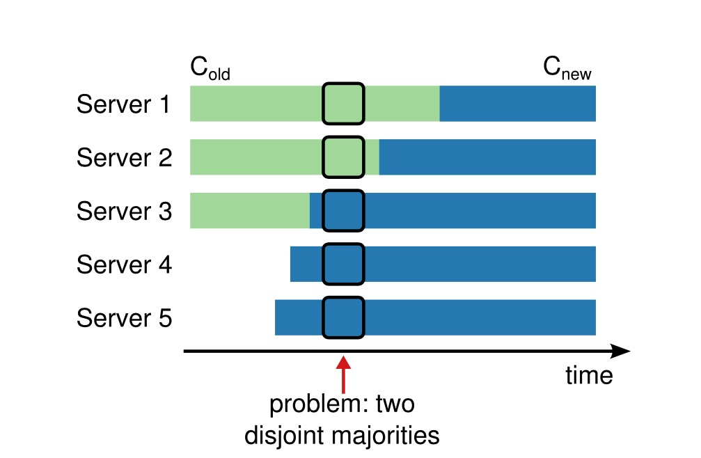
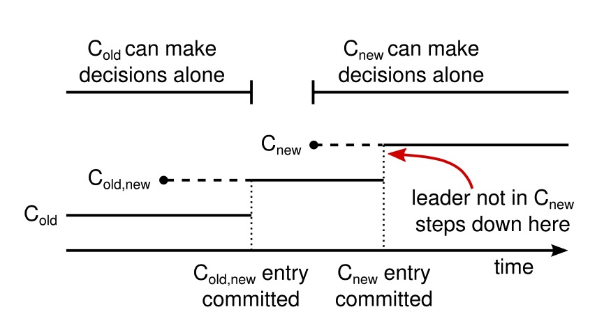

title: 6.824 Lecture 7 Fault Tolerance Raft (2) Notes & Paper Reading
date: 2021-11-18
category: course
tags: mit6.824, distributed-system, raft, paper-reading
slug: mit6.824-letcture5-notes-raft2
author: tonychow
summary: 

## 1 概要

本节课继续 Lecture 5 的内容，对 Raft 论文剩下的内容进行了讨论，主要是包含日志复制的一些异常处理、持久化、压缩和快照，其中论文中的 Raft 集群新旧配置变化的联合一致相关内容略过没有详细讨论，但是课堂上学生比较多的问题都是围绕着这个点提出的。此外，还稍微提及了一致性模型中的线性一致性(linearizability)相关内容。

本课相关的材料:

- 课堂 Paper:  https://pdos.csail.mit.edu/6.824/papers/raft-extended.pdf
- 课堂录像: https://youtu.be/h3JiQ_lnkE8
- 课堂 Note: https://pdos.csail.mit.edu/6.824/notes/l-raft2.txt

PS. Lecture 6 是 TA 代讲的 lab1 MapReduce 的 Q&A，没太多感兴趣的内容，所以就直接跳过了。

## 2 要点

### 2.1 Raft 日志

客户端对一个有 leader 节点，正常运行的 Raft 集群的访问：

- 客户端只能与 leader 节点交互；
- 客户端看不到 follower 节点的状态或者日志；

但是，当 Raft 集群中的 leader 进行切换时，很多异常和错误都有可能发生，从应用的角度来说，我们希望能保证：

- 当任意服务节点执行一条日志条目中的命令，其他的服务节点不能从同一条日志目录中执行不同的命令

这主要是为了保证状态机的安全性，避免在 leader 切换后对客户端展示不一致的状态，违背了集群对外展示为一个单独整体系统的初衷。

不过服务节点之间的日志的确是有可能产生冲突：

- leader 节点在接收到客户端请求，保存到自身的日志队列，发送 AppendEntries RPC 请求给其他 follower 节点之前宕机；
- 其他节点选举后成为新的 leader，再次接收其他客户端的请求，之前的 leader 恢复启动后可能就出现节点间日志队列不一致的情况；

在服务节点之间的日志数据产生冲突时，Raft 强制 follower 节点同步 leader 节点日志来维持一致性，也就是以有效的 leader 节点的日志队列为准。这就涉及到 leader 和 follower 节点之间日志同步的处理，这块内容是上节课涉及的 Raft 论文部分有详细的步骤。简单来说，整个同步方案还是通过 AppendEntries 来实现的，在 follower 发现自身的日志和 leader 不一致时，将会返回错误响应给 leader ，然后 leader 回退同步给该 follower 的日志，直到一致，之后就按 leader 同步过来的进行覆盖。

选举限制：Raft 集群中的节点处理 RequestVote  请求时只给至少和节点日志一样新的 candidate 投票，这个新的定义是：

- candidate 最后一条日志有更高的 term 值；
- candidate 最后一条日志有一样的 term 值，但是有一样或者更长的日志索引；

这个选举限制可以保证新的 leader 能包含所有可能已经提交的日志，这块内容也是上一节课论文部分包含的。

### 2.2 持久化

当一个服务节点宕机时，我们希望 Raft 集群可以正常运行，但是宕机的节点也需要尽快恢复或者被替换，以避免整个集群的可用节点数量低于半数，有两个策略：

1. 用一个新的服务节点替换：需要同步整个当前的日志和恢复状态机状态；
2. 重启宕机的服务节点，重新加入到集群中，并追上落后的日志和恢复状态一致；

本节主要是关注第二个方案，以及需要实现的服务节点数据持久化处理。

持久化和恢复时需要的数据相关，以下是相关的数据：

- 日志队列数据：维持日志队列，保证已提交的日志不会丢失；
- 当前的 term 值：保证 term 值只会增加，不能恢复为 0 ，影响后续的选举；
- 投票给的节点 voteFor：防止一个节点投票给一个 candidate 节点后，重启又参与这轮选举；

持久化通常是会对性能产生影响的：

- 普通磁盘写要 10ms，而 SSD 写只需要 0.1ms ；
- 实现上可能需要每个日志都进行持久化操作，这样限制整个集群的处理能力为 100 ~ 10000 操作/s ；

进行了关键数据持久化处理后，服务节点又要怎么启动恢复状态和数据呢？通常是下面两种方案：

- 初始为空状态，将整个持久化的日志队列中已经提交的命令重新执行，这样可以恢复到宕机前状态，但是耗时会比较长，并且对于运行很久产生了很多日志的 Raft 节点这个方案也不现实；
- 使用快照，只重新执行后面的一部分日志，这个方案就是下一部分的主题；

### 2.3 日志压缩及快照

当一个 Raft 集群运行足够长时间后，通常会面临一个问题：日志会越来越大，甚至有可能比整个状态机要大很多，这样无论是重启进行日志的重新执行还是发送给另外一个新启动的服务节点，都需要非常长的时间。

考虑实际应用时，客户端实际上并不关心和需要整个运行中产生的日志，只是需要状态机中的状态，而在一般的应用场景中，状态机往往是比日志要小得多的(指的是有限数量的 key 不断被更新、删除的场景)，所以一个考虑方案是对状态数据进行持久化保存。

对状态机数据的保存成为一个快照，而快照成功保存后，快照的最后一条相关日志及之前的都是可以被安全地删除的，这也就实现了对日志队列压缩的效果。

服务节点不能删除的日志条目：

- 未执行的日志条目：还没有被状态机应用；
- 未提交的日志：有可能在将来被 leader 确认提交，保存在多数服务节点上；

解决方案：

- 服务定时创建一个当前状态的快照：以一个特别的日志执行条目的方式；
- 服务将快照写到一个持久化存储中 (比如磁盘)；
- 快照记录了包含的最后一条日志目录的索引，通知到 Raft ；
- Raft 撤销日志队列该索引之前的所有日志；

宕机后重启：

- 服务从磁盘读取快照；
- Raft 模块从磁盘读取日志；
- 服务通知 Raft 模块设置 lastApplied 为快照最后包含的日志条目的索引，避免重新执行已快照保存的命令；
- 接下来就是 Raft 正常的应用日志流程；

还有个问题需要考虑：当 follower 宕机，但是 leader 节点执行了快照，导致部分还没同步到 follower 节点的日志被取消时要怎么处理？Raft 新增了一个 InstallSnapshot RPC 请求来处理这种情况，同时也应用于新 follower 节点加入集群同步状态的处理。

实现时有几个点需要注意：

- Raft 的快照方案适合于状态空间相对小的情况，对于大数据库，比如状态空间就包含几个 GB 数据，实行起来就不是那么合适；
- 这种情况，状态数据可能需要一直保存在磁盘上，使用 B-Tree 或者 LSM 等数据结构；

### 2.4 线性一致性(linearizability)

对于一个支持 Put/Get 操作的 kv 存储服务来说，对于客户端需要能够对并发操作下操作的执行顺序有一定的预期。通常这称为一致性模型，有助于我们明白要怎么正确地处理复杂的情况，比如并发、复制、异常、RPC 请求的重传、leader 切换等等。

线性一致性是对于期待能够表现为一个单服务(强一致性)的分布式最常见并且最直接的正式定义：如果我们可以为所有的操作找到一个完全的执行顺序，并且这个顺序符合时间顺序，每个读操作可以看到顺序上紧接着的前一个写操作的值，那么这个执行历史就是线性的。简单来说，在这个系统中，如果一个数据对象被更新了，那么时间上后续的读操作应该可以读到这个新的值。

### 2.5 重复 RPC 检测

当客户端和 Raft  leader 之间出现网络异常导致请求超时的时候，通常是要求客户端不断地进行重试请求的。这样的情况下，服务端需要考虑对重复 RPC 的检测相关的问题，以便实现操作的幂等性。

- Raft 模块上层的 k/v 服务负责重复客户端请求检测
- 客户端每次请求选择一个 id ，包含在请求中
- k/v 服务保持一个根据 id 索引的表，每个 rpc 请求都创建一个条目，并且保存执行后的结果
- 如果另外一个 rpc 请求也包含了同样的 id ，从表中检测确定为重复的请求，则直接把记录的值返回给客户端；

上面这个设计有几个问题需要考虑：

- 什么时候这个记录 rpc id 和值的表可以安全删除？不删除的话会占用资源
- 如果进行了 leader 切换，那么这个表要怎么同步给新的 leader ?
- 如果服务节点宕机，那重新期待时怎么恢复这个表？

一些想法：

- 每个客户端一个表条目，不用每个 rpc 请求一个条目，这样可以减少整个表的大小
- 每个客户端每次只能有一个 RPC 请求
- 每个客户端递增地标识 RPC 请求
- 当服务接收到客户端一个新的 RPC 请求，比如 #10，那么更前的请求可以放弃重复检测了，因为客户端不会重复发送更旧的 RPC 请求

### 2.6 只读操作

在一个 Raft 集群中，对于读请求也需要先进行同步日志和提交才能向客户端响应，不然会出现下面一种情况：

- leader 接收到客户端的 Get(k) 请求；
- 此时，Raft 集群的 leader 进行了切换，原 leader 状态已经切换为 follower；
- 原 leader 并没意识到新的选举，从自身的 kv 表获取 k 对应的 value 返回给客户端；

这个情况可能会导致客户端读取到旧的数据，也就违背了 Raft 线性一致的保证。但是通常情况下，大部分的应用都是读多于写的，每次读都需要进行一次日志同步实现上会相对低效，性能可能不太理想。

有一种解决方案是使用租约 (lease) ，需要对 Raft 算法进行调整:

- 定义一个租约的时长，比如 5 秒；
- 每次 leader 得到一次的 AppendEntries RPC 请求的多数成功响应，就表明当前这个 leader 有权力在租约时间内响应只读的请求，而不需要提交任何的日志；
- 如果在租约有效期内，发生了新的选举，新的 leader 在原租约过期前都不能处理 Put 请求；

本课程的实验中并不要求实现租约机制。

## 3 Paper

lecture 5 的内容是到 Raft 论文的第五节，本节课对论文剩余的内容进行阅读讨论。其中第六节关于 Raft 集群成员变化相关的内容本来在课程安排上是略过的，但是在课程中不少学生都提及了相关的问题。在这里，我也决定不跳过这一部分内容，毕竟也属于 Raft 实际实现时需要考虑的非常重要的一个主题。

剩余部分内容包含以下：

- 集群成员变化
- 日志压缩
- 客户端交互

其他部分则是实现和性能及教学效果的评估，和最后的总结内容，不包含在这里对论文的阅读思考内容中。

### 3.1 集群成员变化

对于一个真实业务上运行的分布式系统来说，集群的成员并不是一成不变的，服务器的替换和更新以及因为异常或者性能缺口导致的增补，都是日常系统运维中不可避免的事情。这也就意味着，Raft 集群的运行中，可能会发生成员的数量变化，也就是集群的配置发生了变化。

在业务持续运行的过程中，停机更新不是一个好的选择，因为停机意味着业务的停止，同时复杂的运维操作也可能会产生灾难性的意外后果。基于减少配置变更对正常业务影响的考虑，Raft 提出了一种把配置更新和融合进一致性算法里的自动更新配置的方案。

成员配置发生变化时，在集群节点新旧切换的过程中，一定要尽量避免出现 2 个 leader 的情况，这样会直接影响到数据的一致性，违背了 Raft 算法保证的各种安全性原则。而直接从旧成员切换到新成员的方案，因为难以实现原子性地同时切换所有节点，所以集群还是可能会出现脑裂的情况。

基于保证安全性的考虑，通常是需要采用两步 (two-phases) 的方案来实现，不同的系统有多种实现方案，在 Raft 这里，线上将集群切换为一个被称为联合一致的过渡的配置状态，一旦联合一致相关日志被提交，整个系统就切换为新的配置。

联合一致的情况同时包含了新旧的配置：

- 日志条目会被复制到两个配置的所有服务节点上；
- 两个配置中的服务节点都有可能被选为 leader；
- 选举和日志条目的提交需要同时分别获得两个配置中的多数节点一致同意；

联合一致支持新旧配置中的所有节点在不同的时间切换配置并且不会影响到算法的安全性。并且，在配置切换过程中，集群还能够继续对外部提供服务，响应客户端请求。

集群的配置是通过特别的日志条目来保存配置及通信的，如上图所示，配置切换的处理流程如下：

1. 当 C‘old 配置下的 leader 接收到更新配置的请求时，将会保存这个请求及配置为联合一致处理的一条日志，也就是图中的 C'old,new ，然后将这条日志复制到新旧服务节点上；
2. 一个服务节点一旦处理到这条日志，将会将新配置中的服务节点信息添加到其日志中，并且在将来的所有决策中都会使用这个新的配置，注意并不要求这条日志已经复制到多数节点；
3. 这过程中如果 leader 节点宕机，新的 leader 将会基于 C'old,new 的配置选出，一旦 C'old,new 被提交，则独立的 C'old 或者 C'new 都不可能缺少彼此的情况下作出决策，基于 leader 完整性的原则，只有包含了 C'old,new 的节点才能赢得选举;
4. 在 C'old,new 被提交后，现在 leader 可以基于联合一致的状态创建一条描述了新集群配置的日志并且复制到多数节点上，也就是上图中 C'new 出现的位置，同样，每个服务节点接收到新的配置后会立即生效，也就是会清除旧的配置；
5. 当 C'new 被复制到多数节点后，旧的配置项对于集群来说就再也不会有任何的影响了，其中不在新配置项的节点都可以被安全地关闭，这时候不在新配置节点中的 leader 将会退出。

从上面的处理流程来看，在新旧配置切换过程中，并不会出现新、旧配置的节点同时成为 leader 分别进行决策的情况，也就保证了 Raft 算法在配置切换中的安全性。

对于配置更新的处理，下面还有 3 个值得注意的问题：

1. 新加入集群的节点并没有任何日志数据，如果新节点一加入集群就开始上面这个流程，那么配置切换可能需要等待该新节点的日志同步追上最新进度才能开始，为了减少这其中的时间差，Raft 新增了一个新的额外阶段，新的节点加入集群后会被视为非投票节点，leader 会复制同步日志到这些节点，但是不会视其为决策中的多数，一旦新节点的日志追上集群其他服务，就可以按照上面的流程继续处理；
2. 在配置切换过程中，集群中的 leader 节点可能不包含在新的配置中，这个时候在 C'new 日志提交后，leader 将会退出转换为 follower 状态，而新配置中的节点将开始新的选举，从新配置中节点选出一个新的 leader，这是一种比较特别的情况，也就是旧配置中的 leader 进行着不包含自身的决策；
3. 被移除的服务节点如果并没有关闭，有可能在选举超时后在集群中发起新的投票，导致整个集群进行选举处理，并且每次选举超时都会触发，为了解决这个问题，Raft 的服务节点在处理 RequestVote 请求时，如果认为当前存在有效的 leader 节点，则忽略该请求，实际上指的就是在自身的选举超时前成功收到了 leader 的心跳；

### 3.2 日志压缩

在一个 Raft 集群的正常运行中，其日志队列和数据随着客户端请求不断增加，从目前看到的实现来看，如果没有任何处理，那么理论上日志数据会无限制地增长，占据所有可用的磁盘空间。更糟糕的是，存在大量日志数据时，一个节点重启时，需要重新执行大量的历史日志保存的命令才能恢复状态到最近，这显然不是实际业务系统可以接受的。

对于 Raft 运行中产生的历史日志，我们有没有必要一直原样保存呢？我们知道日志里面最重要的数据是客户端的命令，而命令是用来改变状态机的状态数据的，状态机的数据才是外部客户端请求需要的。从这个方面来看，Raft 集群中重要的不是所有的历史执行的命令，而是这个状态机。

所以，一种常见的解决方案是使用快照，简单来说，就是将当前状态机所有数据写入一个快照文件，保存在一个可靠存储上。然后整个日志队列的数据，一直到快照数据对应提交的最后一条日志之前的所有日志条目都可以安全地删除。因为通常的业务系统中，状态机的总数据量是有限的，所以这样可以将日志数据量压缩为状态机状态数据大小，从而减少了日志的占用的空间大小。对于状态机本身就特别大的系统，快照方案可能并不太适用，这类型系统可以考虑直接把状态数据保存在可靠存储上。

如上图所示，Raft 中的快照方案主要是有以下几点：

- Raft 集群中每个服务节点是独立地执行各自的状态机快照处理，数据主要是当前节点的状态机数据，并且只覆盖已提交的日志条目的命令执行结果；
- 快照包含了部分的元数据：最后一条被包含的日志的索引及任期值，主要是用于 AppendEntries 的请求，另外还有集群的当前配置信息；
- 快照文件写成功后，这个节点就可以删除掉旧的日志了，另外之前创建的快照数据也可以进行删除处理；
- 如果某个 follower 节点大幅度落后 leader 节点或者新的节点加入集群，这个情况下，为了加速节点的状态跟上 leader，可以考虑从 leader 节点发送快照给该节点，Raft 为这个操作新增了一个 InstallSnapshot 的 RPC 请求；
- follower 接收到来自 leader 的 InstallSnapshot 请求时，如果发现发送过来的快照包含的最后日志要比自身日志队列的数据要新，则可以直接删除掉当前的日志数据，加载快照数据恢复状态机，如果快照数据落后于节点日志，则只删除包含的日志条目，保留其余的日志数据；

整个日志方案是和 Raft 之前描述的强 leader 原则是分离的， follower 不需要了解 leader 信息就可以执行快照处理。主要是因为在执行快照时，每个服务节点的状态机的一致性已经由 Raft 算法的一致性保证了，所以不同节点的快照文件不会产生状态数据的冲突，只会有多少的差异。

在实现快照时，有两个性能相关的问题需要注意：

1. 快照执行的时机：太频繁，可能有太多的磁盘 IO ，太少，则冒着存储空间被耗尽的风险，并且启动时可能要更长的时间，因为有更多的日志条目未包含在快照文件中；一个简单的方案是当日志大小达到一个预定义的大小后就执行快照处理，这样额外的磁盘带宽及 IO 开销会比较小；

2. 写快照文件对正常业务的影响：写快照文件可能需要比较多的时间，另外一般来说也不希望在写快照时状态空间发生变化，所以可能会考虑在写快照时停止外部请求，这样的方案实际上就对正常业务造成了影响，所以一般是采用写时拷贝 (copy-on-write) 的方案来实现快照创建处理，以 linux 系统为例，简单来说就是利用 fork 系统调用创建一个子进程共享当前状态机数据，在分离的子进程将状态机数据写入快照文件，同时主进程在执行状态机的写业务时拷贝和修改相关的内存，不影响子进程的状态机副本数据；

### 3.3 客户端交互

除了 Raft 集群节点之间的交互之外，客户端与 Raft 集群的交互在实现上也有很多需要注意的点，本小节就是对这方面的内容进行了补充。

根据之前的描述，客户端应该只与 leader 进行交互，所有的数据应该通过 leader 节点同步日志到其他 follower 节点。但是在一个客户端刚开始连接到 Raft 集群时，它并不了解哪个节点是 leader，此外还存在 leader 异常宕机、leader 切换等情况。所以在实现时，如果客户端第一次请求的节点不是 leader，则这个服务节点将会拒绝客户端请求并提供 leader 的信息，然后客户端重新往 leader 节点发起请求。如果信息不正确，或者提供的 leader 节点请求超时无响应，客户端可以随机选择另外一个节点再次进行请求。

在异常情况下，如果客户端的请求超时没有收到响应，则应该重新再发起请求，这样 Raft 集群可能出现多次处理同一个请求的情况。比如 leader 在提交日志后响应给客户端前宕机了，客户端可能会往新的 leader 发起同样的一个请求，这样就会导致 Raft 集群两次处理同一个请求。解决方案是，客户端每次请求都指定一个唯一的序列号标识这个请求，然后状态机追踪每个客户端最近提交的请求的序号和对应的响应，这样在遇到重复的请求时，直接把已记录的响应返回，不再执行请求的命令。

对于只读请求，因为不会影响到状态机数据，理论上应该是可以不记录相关的操作日志的。但是实现时如果没有额外的操作，很有可能会导致返回过期数据给客户端，因为接收读请求的 leader 服务节点在处理时可能已经不是 leader 了，但是因为没有日志交互，它并没有意识到存在新的 leader 。

为了解决只读请求的问题，Raft 需要两个额外的预防措施来保证：

1. leader 节点在任期开始时提交一个空 (no-op) 的日志条目到日志队列：这样可以让  leader 与各个 follower 进行交互，并且了解最近已经提交的日志信息；
2. leader 节点处理读请求时，在返回给客户端前都需要和集群中多数的节点进行心跳请求，这样  leader 可以确保其自身还是一个有效的 leader ，避免返回过期的数据；

## 4 总结

从这两节课的阅读来看，Raft 论文内容细节丰富，理论性的内容较少，整个算法易于理解，包含了很多实际实现上的考虑，是分布式领域一致性算法相关不可多得的一篇好论文。将一致性算法分为选举和日志复制几个子问题显然更为清晰，而强 leader 的设计对比多 leader 决策的复杂处理逻辑要更易于实现，单一节点以天然有序的日志的方式决定操作的执行顺序也很好地支持了线性一致的实现。

虽然 Raft 论文易于理解，但是一个可以实际应用在生产环境的分布式系统在实现上还是会存在更多的细节和需要考虑的问题，部分性能上的考虑在论文也只是一笔带过，对于系统实现来说却是必须考虑的内容。比如只读操作的性能优化，论文中提及了基于租约 lease 的方式来实现，但是没有提供具体的方案，这只能由系统的实际开发者来进行设计实现了。

当前业界也有不少开源系统基于 Raft 算法实现了容错、可靠的分布式系统，并且实际应用到了生产环境，经受了实际业务的考验，从性能和可靠性都得到了充份验证，下面是几个比较出名的项目：

- [etcd](https://github.com/etcd-io/etcd) : 一个分布式的 k/v 存储系统，对标参考 Paxos 实现的 Zookeeper 项目，常用于可靠存储系统关键数据，比如配置等，或者用于分布式系统中作为服务发现等功能使用，也被 kubernetes 等著名开源系统使用；
- [tikv](https://github.com/tikv/tikv) : 也是一个分布式的 k/v 存储系统，主要是用于为分布式数据库 TiDB 提供可靠的分布式数据存储支持，除了简单的 k/v 操作之外，它还实现了保证 ACID 的事务相关操作，此外，其数据是持久化存储在磁盘上的；

这些开源的基于 Raft 算法实现数据一致的分布式系统在实现上对 Raft 算法有很多的优化和改进，也更多地考虑了实际业务的需求，非常值得参考阅读。
